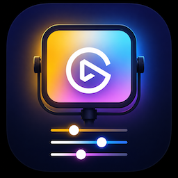

# com.ulanzi.ElgatoKeyLight.ulanziPlugin

Ulanzi Studio plugin to control [Elgato Key Light](https://www.elgato.com/key-light).



- **Toggle** action — turn a Key Light on/off.
- **Dial** action (Encoder) — rotate to adjust brightness, hold + rotate to adjust color temperature.
- Lights are discovered automatically on the LAN via mDNS (`_elg._tcp`); an IP can also be entered manually.


- [Requirements](#requirements)
- [How to](#how-to)
  - [Setup](#setup)
  - [Project layout](#project-layout)
  - [Updating the SDK](#updating-the-sdk)
  - [On-device testing](#on-device-testing)
  - [Debugging](#debugging)
- [Contributing](#contributing)
- [Publishing](#publishing)

## Requirements

- [mise](https://mise.jdx.dev/) (manages the Node toolchain)
- [Ulanzi Studio](https://www.ulanzi.com/pages/ulanzi-app) 3.0.11+

Node is pinned via `mise.toml` (currently Node 24 LTS). This pin governs local
development tooling only — in production the plugin's main service runs on the
Node runtime embedded in Ulanzi Studio.

## How to

### Setup

```shell
mise trust      # trust this project's mise.toml (first time only)
mise install    # install the pinned Node toolchain
mise run setup  # fetch the vendored Ulanzi SDK + install npm dependencies
```

`mise run setup` runs `sync-sdk` (downloads the SDK into `libs/` and
`plugin-common-node/`) followed by `npm install` (`ws`, `bonjour-service`).

### Project layout

```plain
manifest.json            Plugin configuration
mise.toml                Node pin + setup/sync-sdk tasks
libs/                    Vendored common-html SDK (Property Inspector)
plugin-common-node/      Vendored common-node SDK (Node main service)
plugin/app.js            Main service: deck events -> Key Light HTTP
plugin/discovery.js      mDNS discovery of Key Light devices
property-inspector/      Configuration UI (IP / device picker)
resources/               Plugin & action icons (PNG)
```

The vendored SDK directories (`libs/`, `plugin-common-node/`) are committed so the
plugin folder is runnable and shippable as-is. Only `node_modules/` is gitignored.

### Updating the SDK

[Ulanzi SDK](https://github.com/UlanziTechnology/UlanziDeckPlugin-SDK) repos have no tags/releases, so they are pinned by commit
SHA in `mise.toml` (`SDK_HTML_REF`, `SDK_NODE_REF`). To update:

1. Bump the SHA(s) in `mise.toml`.
2. `mise run sync-sdk`
3. Review `git diff` to see exactly what changed upstream.
4. Commit.

### On-device testing

Test the plugin on a real Ulanzi deck + Elgato Key Light.

1. **Deploy** the plugin into the Ulanzi Studio Plugins directory (macOS):

   ```shell
   mise run deploy
   ```

   This rsyncs the repo into
   `~/Library/Application Support/Ulanzi/UlanziDeck/Plugins/com.ulanzi.ElgatoKeyLight.ulanziPlugin/`
   (dev-only files excluded; `node_modules/` included — the runtime needs it).
   Studio loads the folder as a real copy — it does **not** follow symlinks.

2. **(Re)start Ulanzi Studio** so it loads/reloads the plugin. Studio does not
   hot-reload plugin code and does not auto-respawn a stopped plugin service, so
   after any code change you must fully quit Studio (Cmd+Q) and relaunch:

   ```shell
   open "/Applications/Ulanzi Studio.app" --args --log --webRemoteDebug --nodeRemoteDebug
   ```

3. **Prepare the light**: power on the Key Light on the same LAN (required for
   mDNS discovery and HTTP control).

4. **Configure & test** in Studio:
   - Drag the **Toggle** action onto a key and the **Dial** action onto an encoder.
   - Open the action's Property Inspector and pick the discovered light (or enter its IP).
   - Press the key to toggle; rotate the dial for brightness, hold + rotate for color temperature.

5. **Inspect logs** — the main service log (inbound/outbound WS frames, `logMessage`):

   ```plain
   ~/Library/Application Support/Ulanzi/UlanziDeck/logs/com.ulanzi.ulanzistudio.elgatokeylight/
   ```

After editing code, re-run `mise run deploy` and restart Studio (step 2).

> [!NOTE]
> The author has only been able to test this in the following single environment:
>
> - macOS 26.5.1
> - [Ulanzi D200X](https://www.ulanzi.jp/products/ulanzi-d200x-creative-deck-a045)
> - Elgato Key Light Air
>
> If you encounter any issues on other platforms (e.g., Windows), with other Ulanzi decks, or with other Key Light models, please let me know.

### Debugging

Launch Ulanzi Studio with debug flags, then attach:

```shell
# macOS
open /Applications/Ulanzi\ Studio.app --args --log --webRemoteDebug --nodeRemoteDebug
```

- **Node main service** (`plugin/app.js`): open `chrome://inspect` in Chrome and click *inspect*.
- **Property Inspector** (HTML): open `localhost:9292`.

A standalone smoke test of the main service (Ulanzi Studio not required for import resolution):

```shell
node --check plugin/app.js
node plugin/app.js   # connects to Studio if running; otherwise waits/retries
```

## Contributing

Contributions are welcome. See [CONTRIBUTING.md](./CONTRIBUTING.md) for the
development setup, formatting/linting, commit conventions, and PR workflow.

## Publishing

Build the distributable for the official Ulanzi marketplace
([Ulanzi UGC Hub](https://ugc.ulanzistudio.com/)) with `mise run package`, which
produces `dist/com.ulanzi.ElgatoKeyLight.ulanziPlugin.zip`.

The pre-submission checklist and submission process are documented in the
[project wiki](https://github.com/shin-sforzando/com.ulanzi.ElgatoKeyLight.ulanziPlugin/wiki).
